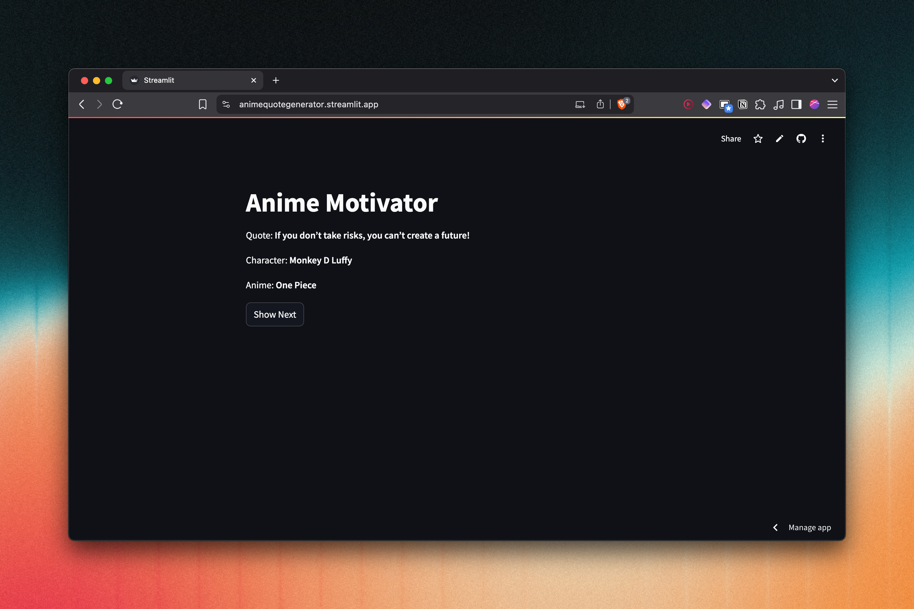

# 🌸 Anime Motivator

**Anime Motivator** is a simple yet inspiring Streamlit web app that displays motivational quotes from popular anime characters. Whether you're looking for a daily dose of encouragement or just want to relive some legendary anime moments, this app has you covered.

---

## 📸 Demo



---

## 🚀 Features

- 🎌 Displays random motivational quotes from anime
- 🧑‍🎤 Shows the character and anime associated with each quote
- 🔁 "Show Next" button to cycle through quotes
- 💾 Remembers your place using session state
- 🛠 Easy to customize or expand with your own quotes

---

## 📦 Installation

1. **Clone the repository**
   ```bash
   git clone https://github.com/your-username/anime-motivator.git
   cd anime-motivator
   ```

2. **Install dependencies**
   It's recommended to use a virtual environment:
   ```bash
   pip install -r requirements.txt
   ```

3. **Prepare the CSV file**
   Make sure you have a `data.csv` file in the same directory with the following structure:

   ```csv
   Quote,Character,Anime
   "Hard work is worthless for those that don’t believe in themselves.","Naruto Uzumaki","Naruto"
   "A lesson without pain is meaningless.","Edward Elric","Fullmetal Alchemist: Brotherhood"
   ...
   ```

4. **Run the app**
   ```bash
   streamlit run app.py
   ```

---

## 🧾 Project Structure

```
anime-motivator/
├── main.py             # Main Streamlit application
├── data.csv           # CSV file containing anime quotes
├── requirements.txt   # Python dependencies
└── README.md          # This file
```

---

## 🛠 Requirements

- Python 3.7+
- Streamlit
- pandas
- random

You can install all dependencies via:

```bash
pip install -r requirements.txt
```

---

## 📌 To-Do / Future Improvements

- Search quotes by anime or character
- Add background themes (dark/light modes)
- Include images or GIFs of characters
- API integration for fetching new quotes dynamically

---

## 🤝 Contributing

Contributions are welcome! Feel free to open an issue or submit a pull request.

---

## 📃 License

This project is licensed under the [MIT License](LICENSE).

---

## ❤️ Acknowledgements

Inspired by anime legends who continue to motivate us daily.  
Built with [Streamlit](https://streamlit.io/) and love.
